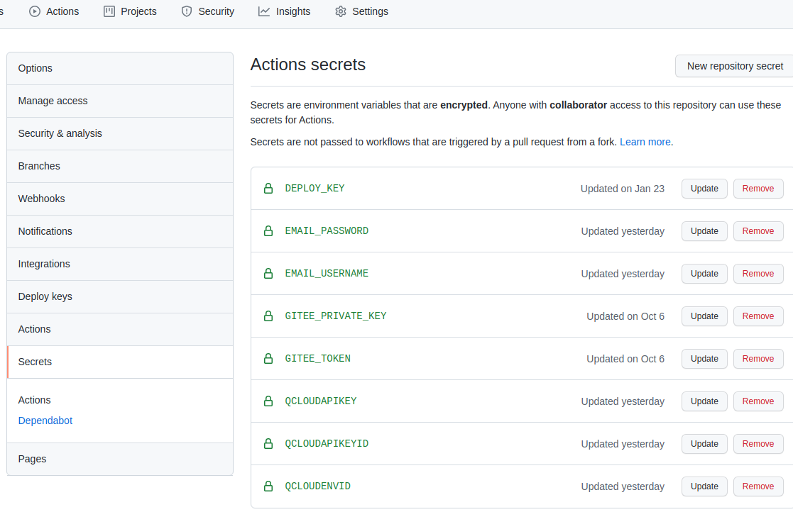

# Deply hexo to Tecent cloud

<a href="https://github.com/marketplace/actions/hexo-action"></a>
<a href="https://opensource.org/licenses/MIT"></a>

This Github Action automating hexo deployment workflow, to allow you to leverage GitHub Actions to publish your hexo site on Tencent Cloudbase environemnt to 
achieve static web hosting.

**Recommened**:


About Tencent Static Web Hosting: [Link](https://console.cloud.tencent.com/tcb/hosting/index). It's free. About 5GB cloud storage, 5GB cloud database, 1000Gbs cloud function every month.:stuck_out_tongue_winking_eye:

## Usage
**Inputs**

argument | Required | Description 
 --- | --- | ---  
 `cloud_secret_id` | **yes** | Access key of cloud development: secretId
`cloud_secret_key` | **yes** |Access key of cloud development: secretKey
`cloud_env_id`| **yes**  | Cloud development environment ID: envId 

Getting **secretId** and **secretKey** by Visiting Tencent Cloud [Access management](https://console.cloud.tencent.com/cam/capi).

Gettting **envId** by visiting Tencent Cloudbase development [console](https://console.cloud.tencent.com/tcb/env/index).

About **secretId**, **secretKey** and **envId**, you can visit this [website](https://ytlee.cn/2021/03/use-github-actions-to-automatically-publish-static-blogs-to-tencent-cloud-static-website/) which can guide you to get your **secretId** **secretKey** and **envId**.

**Notice**

`cloudbaserc.json` file which is used by `cloudbase-action` is not needed.

For installing third party node modules, please make sure there is a  `package.json` file in your hexo project.
## Example
```yml
name: Deploy To Tencent Cloud

on:
  [push] # event

jobs:
  build: # job1 id
    runs-on: ubuntu-latest # Ubuntu Version

    name: A job to deploy blog.
    steps:
    - name: Checkout 
      uses: actions/checkout@v1 
      with: # condition
        submodules: true # Checkout private submodules(themes or something else).

    - name: Deploy Hexo to Tencent Cloudbase environment
      uses: elfisworking/Deply_hexo_to_Tecent_cloud@1.0.0
      with:
        cloud_secret_id: ${{ secrets.QCLOUDAPIKEYID }}
        cloud_secret_key: ${{ secrets.QCLOUDAPIKEY }}
        cloud_env_id: ${{ secrets.QCLOUDENVID }}

    - name: Send mail
      if: always()
      uses: dawidd6/action-send-mail@v2
      with:
        # mail server settings
        server_address: smtp.exmail.qq.com
        server_port: 465
        # user credentials
        username: ${{ secrets.EMAIL_USERNAME }}
        password: ${{ secrets.EMAIL_PASSWORD }}
        # email subject
        subject: ${{ github.job }} job of ${{ github.repository }} has ${{ job.status }}
        # email body as text
        body: ${{ github.job }} job in worflow ${{ github.workflow }} of ${{ github.repository }} has ${{ job.status }}
        # comma-separated string, send email to
        to: user@gmail.com
        # from email name
        from: Service_bot
```
About `${{ secrets.QCLOUDAPIKEYID }}` and so on, you can set it in repo's setting. 




## Reference
* [hexo action](https://github.com/sma11black/hexo-action)
* [cloudbase-action](https://github.com/TencentCloudBase/cloudbase-action)
* https://ytlee.cn/2021/03/use-github-actions-to-automatically-publish-static-blogs-to-tencent-cloud-static-website/

## License
The scripts and documentation in this project are released under the [MIT License](LICENSE)